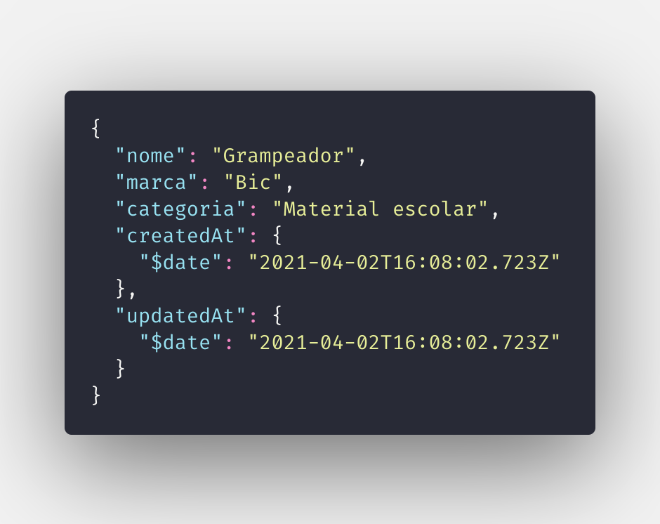

<h1 align="center" id="introducao">Introdução ao MongoDB</h1>

O MongoDB é um banco de dados NoSQL baseado em documentos. Isso quer dizer que, diferente das tradicionais linguagens de banco de dados (aka SQL), o Mongo salva seus dados como objetos JSON. Por exemplo, para salvar uma pessoa com alguns atributos, pode-se fazer da seguinte forma:
 
 

 
 
Dentre as vantagens de se usar o Mongo, podemos listar:
- **Modelo de dados mais intuitivo**:
  Por padrão, os desenvolvedores já estão acostumados a ver objetos em seu dia a dia. Dessa forma, se torna muito mais natural usar esse mindset na construção do seu banco de dados. Não há necessidade de separar o dado em diversas tabelas, gastar seus neurônios com joins ou integrar ORMs separados. Os dados são acessados e gravador juntos, dessa forma, dando uma melhor performance através de menos linhas de código (e menos debug/dor de cabeça).
- **Esquemas flexíveis e adaptáveis**:
  Os `schemas` (esquemas) do mongo são extremamente dinâmicos e flexíveis. Não há necessidade de pre-definir os dados no seu banco de dados (ou tabela). Os atributos podem variar de documento para documento, e você pode mudar as estruturas a qualquer momento.
- **JSON em todo lugar**:
  Leves, independentes de linguagem e `human readable` (legível para pessoas não devs), o JSON foi estabelecido como padrão para os dados salvos no mongo. Essa decisão facilita muito a compreensão dos desenvolvedores, principalmente pelo fato de que a grande maioria das APIs modernas adotam JSON como modelo de dados para suas requisições.

 

Próximo tópico: <a href="2-preparacao-ambiente.md#preparacao-ambiente">2. Preparação do ambiente</a>

Voltar para a <a href="../README.md#readme">Home</a>
