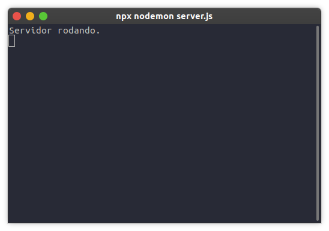
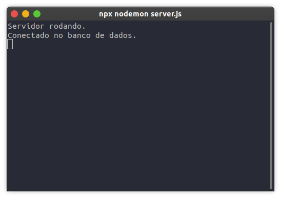

<h1 id="iniciando-projeto">Iniciando o projeto</h1>

Primeiramente, crie a pasta do projeto. Dentro dela, rode os seguintes comandos:

```
# inicia o package.json do projeto
$ yarn init


# instalará as dependências que utilizaremos
$ yarn add express mongoose

# instalará o nodemon como dependência de desenvolvimento
$ yarn add --dev nodemon
```

O Nodemon recompila o servidor novamente a cada alteração no código do projeto, evitando muitos erros e facilitando o desenvolvimento.

Agora, crie o arquivo `server.js` na raiz do seu projeto e abra no seu editor de código preferido.

O primeiro passo no nosso projeto será criar a nossa API. Para isso, iremos abrir o `server.js`, importar o `express` e rodar o nosso servidor na porta `3000`.

```
const express = require('express');

const app = express();

app.use(express.json());

app.listen(3000, () => {
  console.clear();
  console.log('Servidor rodando.');
});
```

Agora, para ver o servidor rodando, abra um terminal na pasta do seu projeto e rode o comando:

```
$ npx nodemon server.js
```

Se tudo ocorrer como planejado, você verá no seu terminal:



Agora, estabeleceremos a conexão com o MongoDB. Iremos conectá-lo diretamente na base que utilizaremos, `mongodb4noobs`. Logo abaixo da importação do express na linha 1, adicionaremos as seguintes linhas:

```
const mongoose = require('mongoose');

mongoose
  .connect(`mongodb://localhost:27017/mongodb4noobs`, {
    useNewUrlParser: true,
    useUnifiedTopology: true,
    useFindAndModify: false,
  })
  .then(() => console.log('Conectado no banco de dados.'))
  .catch((err) => console.log(`Rolou algum erro na conexão: ${err}`));
```

Dessa forma, se ocorrer algum erro na conexão, você o verá no console e precisará dar uma debugada para ver o que rolou. Caso contrário, você verá no console o `Conectado no banco de dados`.



Agora que tudo está funcionando como deveria, iremos criar o nosso primeiro `model`, para em seguida criarmos as rotas!


Próximo sub-tópico: <a href="4-2-criando-model.md#criando-model">Criando o primeira model</a>

Próximo tópico: <a href="5-conclusao.md#conclusao">Conclusão do curso</a>

Voltar para a <a href="../README.md#readme">Home</a>
