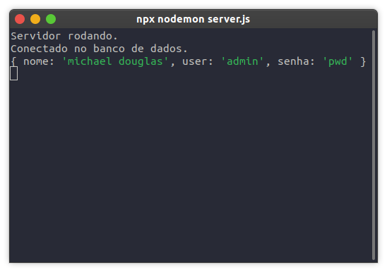
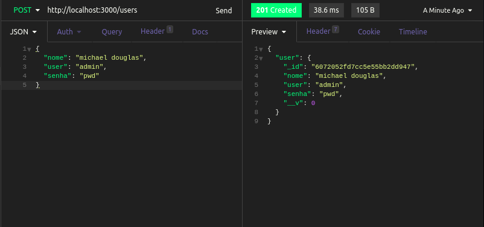

<h1 id="estabelecendo-rota-create">Estabelecendo rota para criar usuários</h1>

Primeiramente, iremos criar uma rota para cadastrar usuários utilizando o método `post`.

Logo abaixo da linha do `app.use(express.json());`, iremos criar a nossa rota que irá receber um objeto JSON contendo o nome, o user e a senha do nosso usuário, e imprimí-los no console:

```
app.use(express.json());

app.post('/users', async (req, res) => {
  const user = req.body;
  console.log(user);

  res.sendStatus(201);
});
```

Agora, envie uma requisição `post` para `http://localhost:3000/users` com o seguinte objeto:

```
{
	"nome": "michael douglas",
	"user": "admin",
	"senha": "pwd"
}
```

E verifique que no seu console se encontrará o user:



Agora, só o que falta é salvar esse usuário, pois estamos apenas imprimindo ele no console. Para salvá-lo, você pode utilizar a função `create` do nosso model, da seguinte forma:

```
app.post('/users', async (req, res) => {
  const user = req.body;

  // criando usuário
  const createdUser = await User.create(user);

  // enviando de volta o usuário criado
  res.status(201).json({ user: createdUser });
});
```

Ao testar no Insomnia, você poderá ver que a nossa API recebeu os dados, salvou no banco e retornou o usuário salvo:



Note que o atributo `_id` não estava no nosso model, mas foi gerado automaticamente pelo MongoDB, de forma que cada usuário terá o seu UUID, e será identificado por ele!


Próximo sub-tópico: <a href="4-4-estabelecendo-rota-read.md#estabelecendo-rota-read">Estabelecendo as rotas read</a>

Próximo tópico: <a href="5-conclusao.md#conclusao">Conclusão do curso</a>

Voltar para a <a href="../README.md#readme">Home</a>
