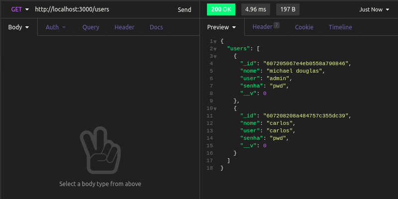

<h1 id="estabelecendo-rota-read">Estabelecendo rota para buscar usuários</h1>

Agora, criaremos duas rotas `get`, uma para buscar todos os usuários, e outra para buscar um usuário em específico passando seu `_id` como parâmetro.

A primeira rota poderá ser facilmente criada utilizando a função `find`, do nosso user model (sim, o mesmo nome da função nativa do Mongo!):

```
app.get('/users', async (req, res) => {
  const users = await User.find();

  res.status(200).json({ users: users });
});
```

Note que, ao enviar um `get` para `http://localhost:3000/users`, você verá nossos usuários listados (provavelmente você criou só um até aqui, mas pode criar mais para ver o efeito dessa função):



A nossa segunda rota `get` será semelhante a primeira, mas será passado o id do usuário que queremos na própria url - `http://localhost:3000/users/:id`, dessa forma:

```
app.get('/users/:id', async (req, res) => {
  const id = req.params.id;
  const user = await User.findById(id);

  res.status(200).json({ user: user });
});
```

E agora, ao enviar a requisição `get` para a API, passando o id de um usuário existente, você verá:


Próximo sub-tópico: <a href="4-5-estabelecendo-rota-update.md#estabelecendo-rota-update">Estabelecendo a rota update</a>

Próximo tópico: <a href="5-conclusao.md#conclusao">Conclusão do curso</a>

Voltar para a <a href="../README.md#readme">Home</a>
