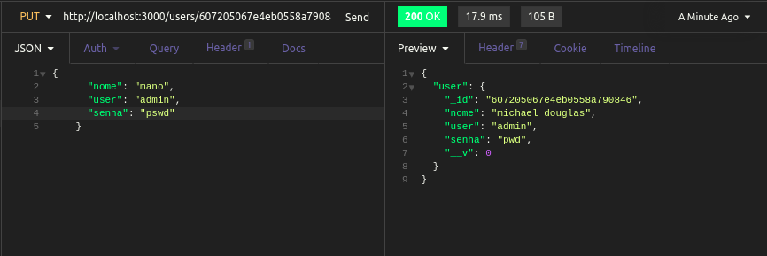
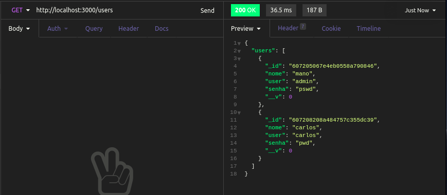

<h1 id="estabelecendo-rota-update">Estabelecendo rota para atualizar usuários</h1>

Agora, criaremos uma rota `put` para atualizar nosso usuário. Para isso, usaremos a função `findByIdAndUpdate()`, que recebe como primeiro parâmetro o id do usuário a ser atualizado, e como segundo parâmetro o body contendo a atualização, da seguinte forma:

```
app.put('/users/:id', async (req, res) => {
  const id = req.params.id;
  const body = req.body;
  const user = await User.findByIdAndUpdate(id, body);

  res.status(200).json({ user: user });
});
```

E agora, ao enviarmos uma requisição para o método `http://localhost:3000/users/:id`, com o método `put` e passando o id de um usuário existente, podemos ter esse resultado:



E podemos ver a mudança após dar um `get` em todos os usuários novamente. O usuário que antes era michael douglas virou o usuário mano:




Próximo sub-tópico: <a href="4-6-estabelecendo-rota-delete.md#estabelecendo-rota-delete">Estabelecendo a rota delete</a>

Próximo tópico: <a href="5-conclusao.md#conclusao">Conclusão do curso</a>

Voltar para a <a href="../README.md#readme">Home</a>
