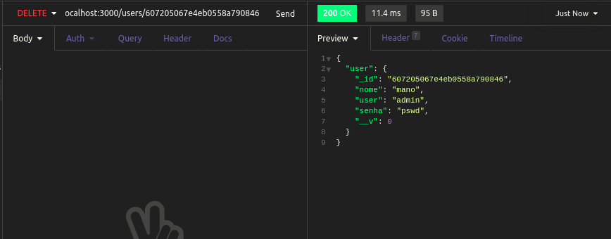
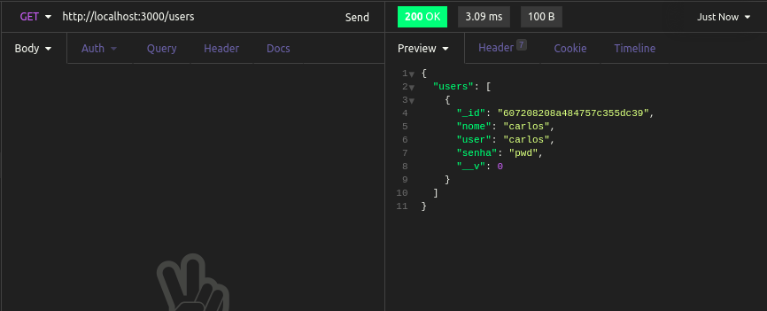

<h1 id="estabelecendo-rota-delete">Estabelecendo rota para apagar usuários</h1>

E agora, para finalizar, criaremos nossa rota para deletar um usuário utilizando o método `delete`, e a função `findByIdAndDelete()`, que recebe como parâmetro o id do usuário a ser deletado:

```
app.delete('/users/:id', async (req, res) => {
  const id = req.params.id;
  const user = await User.findByIdAndDelete(id);

  res.status(200).json({ user: user });
});
```

E, ao executar essa função na rota `http://localhost:3000/users/:id`, com o método `delete` e passando o id de um usuário existente, teremos:



E podemos ver a mudança após dar um `get` em todos os usuários novamente. O usuário que antes era mano foi deletado:




Próximo tópico: <a href="5-conclusao.md#conclusao">Conclusão do curso</a>

Voltar para a <a href="../README.md#readme">Home</a>
